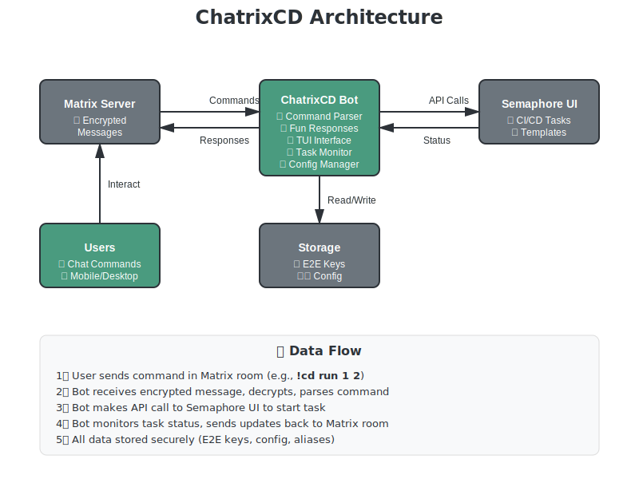

# 🏗️ Architecture

A visual guide to how ChatrixCD works under the hood.

  <strong>💡 Quick Summary:</strong> ChatrixCD bridges Matrix (encrypted chat) and Semaphore UI (CI/CD automation) with a Python bot that handles commands, manages tasks, and provides a beautiful TUI.

---

## 📊 System Overview

  

---

## 🧩 Core Components

  <h3 style="margin-top: 0;">🤖 Bot Core (bot.py)</h3>
  
<strong>The Heart of ChatrixCD</strong>

  <ul style="font-size: 0.9em;">
    <li>Matrix client management</li>
    <li>E2E encryption handling</li>
    <li>Event processing</li>
    <li>Auto-sync & device verification</li>
  </ul>

  <h3 style="margin-top: 0;">⚡ Commands (commands.py)</h3>
  
<strong>Command Processing Engine</strong>

  <ul style="font-size: 0.9em;">
    <li>Command parsing & validation</li>
    <li>Semaphore API integration</li>
    <li>Task management</li>
    <li>Response formatting</li>
  </ul>

  <h3 style="margin-top: 0;">🖥️ TUI (tui.py)</h3>
  
<strong>Interactive Interface</strong>

  <ul style="font-size: 0.9em;">
    <li>Status monitoring</li>
    <li>Room management</li>
    <li>Device verification</li>
    <li>Log viewing</li>
  </ul>

  <h3 style="margin-top: 0;">⚙️ Config (config.py)</h3>
  
<strong>Configuration Manager</strong>

  <ul style="font-size: 0.9em;">
    <li>HJSON parsing</li>
    <li>Schema validation</li>
    <li>Auto-migration</li>
    <li>Secure defaults</li>
  </ul>

  <h3 style="margin-top: 0;">🚀 Semaphore (semaphore.py)</h3>
  
<strong>CI/CD Integration</strong>

  <ul style="font-size: 0.9em;">
    <li>REST API client</li>
    <li>Task lifecycle management</li>
    <li>Status monitoring</li>
    <li>Log retrieval</li>
  </ul>

  <h3 style="margin-top: 0;">📝 Messages (messages.py)</h3>
  
<strong>Response Templates</strong>

  <ul style="font-size: 0.9em;">
    <li>Varied greetings</li>
    <li>Sassy responses</li>
    <li>Auto-reload support</li>
    <li>Emoji & formatting</li>
  </ul>

---

## 🔄 Data Flow

  
1️⃣

  

    <h3 style="margin-top: 0;">User Sends Command</h3>
    
User types <code>!cd run 1 2</code> in a Matrix room

    
🔐 Message is E2E encrypted if room is encrypted

  

  
2️⃣

  

    <h3 style="margin-top: 0;">Bot Receives & Decrypts</h3>
    
Bot receives message event, decrypts it (if encrypted), and parses the command

    
🔍 Command parser validates syntax and permissions

  

  
3️⃣

  

    <h3 style="margin-top: 0;">Request Confirmation</h3>
    
Bot fetches template details and sends confirmation message with reaction buttons

    
👍👎 User reacts with thumbs up/down

  

  
4️⃣

  

    <h3 style="margin-top: 0;">Execute Task</h3>
    
Bot makes API call to Semaphore UI to start the task

    
🚀 Task ID returned and tracked

  

  
5️⃣

  

    <h3 style="margin-top: 0;">Monitor & Update</h3>
    
Bot polls task status and sends updates back to the room

    
📊 Real-time status updates with colored indicators

  

  
6️⃣

  

    <h3 style="margin-top: 0;">Task Complete</h3>
    
Final status sent with completion time and success/failure indicators

    
✅❌ Success = 🎉, Failure = 😔

  

---

## 🔐 Security Architecture

  <h4 style="margin-top: 0;">🔒 E2E Encryption</h4>
  
Matrix-nio handles Olm/Megolm encryption automatically. All encrypted room messages are secure.

  <h4 style="margin-top: 0;">🔑 Key Storage</h4>
  
Encryption keys stored in <code>store/</code> directory with proper file permissions.

  <h4 style="margin-top: 0;">🛡️ Device Verification</h4>
  
Supports emoji, QR code, and fingerprint verification for trusted devices.

  <h4 style="margin-top: 0;">🔐 OIDC/SSO</h4>
  
Native OIDC authentication with major identity providers.

  <h4 style="margin-top: 0;">🚫 Permission Control</h4>
  
Configurable <code>allowed_rooms</code> restricts bot to authorized spaces.

  <h4 style="margin-top: 0;">🔍 Audit Trail</h4>
  
All commands and actions logged for security auditing.

---

## 🎯 Design Principles

<table style="width: 100%; border-collapse: collapse; margin: 2em 0;">
<thead style="background: #3e836b; color: white;">
<tr>
<th style="padding: 12px; text-align: left;">Principle</th>
<th style="padding: 12px; text-align: left;">Implementation</th>
</tr>
</thead>
<tbody>
<tr style="background: #f8f9fa;">
<td style="padding: 12px;"><strong>🔄 Async First</strong></td>
<td style="padding: 12px;">All I/O operations use async/await for non-blocking execution</td>
</tr>
<tr>
<td style="padding: 12px;"><strong>🎭 User Experience</strong></td>
<td style="padding: 12px;">Fun personality, emoji, reaction confirmations</td>
</tr>
<tr style="background: #f8f9fa;">
<td style="padding: 12px;"><strong>🛡️ Security First</strong></td>
<td style="padding: 12px;">E2E encryption, device verification, permission controls built-in</td>
</tr>
<tr>
<td style="padding: 12px;"><strong>🔧 Configuration</strong></td>
<td style="padding: 12px;">HJSON support, validation, auto-migration, sensible defaults</td>
</tr>
<tr style="background: #f8f9fa;">
<td style="padding: 12px;"><strong>📝 DRY Code</strong></td>
<td style="padding: 12px;">Extracted helpers, shared utilities, reusable components</td>
</tr>
<tr>
<td style="padding: 12px;"><strong>✅ Testability</strong></td>
<td style="padding: 12px;">Small focused methods, dependency injection, comprehensive tests</td>
</tr>
</tbody>
</table>

---

## 📦 Technology Stack

  <h4 style="margin-top: 0;">🐍 Python 3.12+</h4>
  
Modern Python with async/await

  <h4 style="margin-top: 0;">📱 matrix-nio</h4>
  
Matrix client with E2E encryption

  <h4 style="margin-top: 0;">🌐 aiohttp</h4>
  
Async HTTP for Semaphore API

  <h4 style="margin-top: 0;">🖥️ Textual</h4>
  
Terminal UI framework

  <h4 style="margin-top: 0;">📝 HJSON</h4>
  
Human-friendly JSON config

  <h4 style="margin-top: 0;">🔐 cryptography</h4>
  
Encryption & key management

---

## 📚 Learn More

  <strong>🔧 Implementation Details</strong>
  
<a href="https://github.com/CJFWeatherhead/ChatrixCD/blob/main/ARCHITECTURE.md">Full ARCHITECTURE.md →</a>

  <strong>🤝 Contributing</strong>
  
<a href="contributing.html">Contributing Guide →</a>

  <strong>🔒 Security</strong>
  
<a href="security.html">Security Policy →</a>

